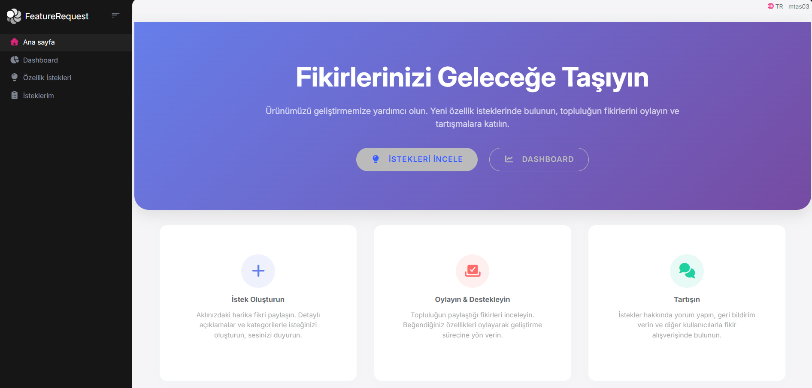
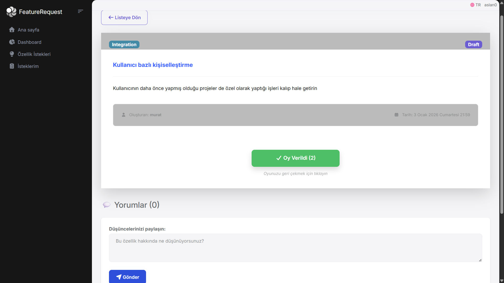
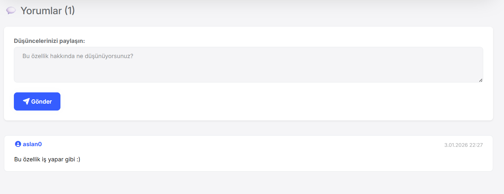
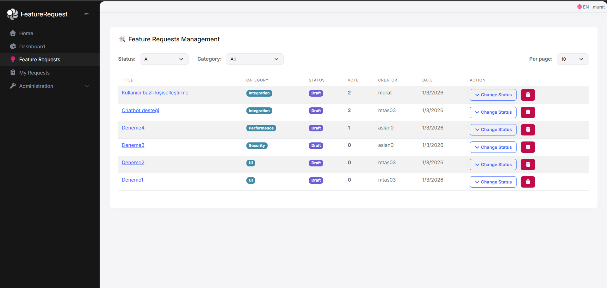
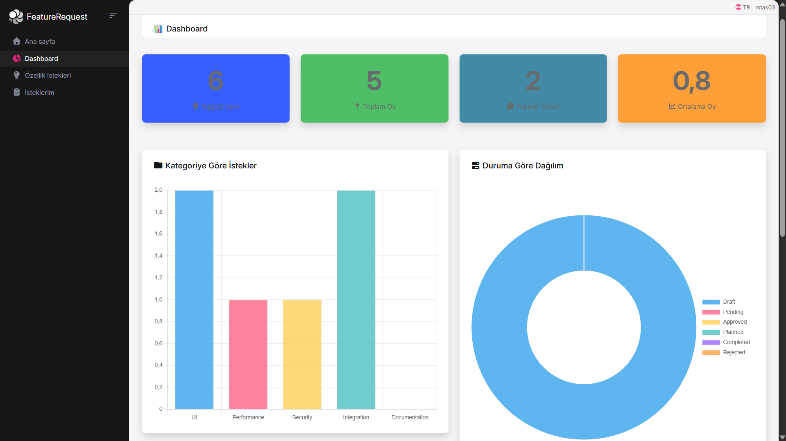
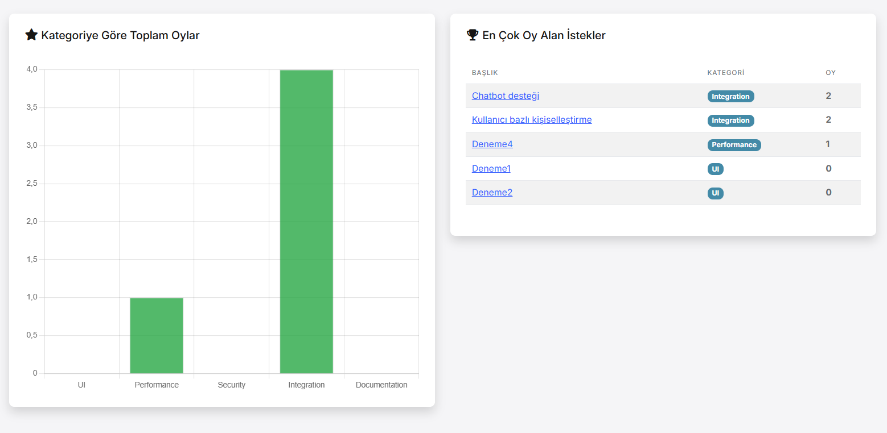

# 🚀 Feature Request Project

Bir SaaS ürününün kullanıcılarından gelen özellik taleplerini toplayan, topluluk oylaması ve yönetici onayı ile önceliklendirme yapan bir portal.

## 🎯 Proje Hakkında

### Amaç
Bu proje, yazılım ürünlerinin geliştirilmesinde kullanıcı geri bildirimlerini sistematik bir şekilde toplamak ve yönetmek için tasarlanmıştır. Kullanıcılar özellik isteklerinde bulunabilir, topluluk bu istekleri oylayarak önceliklendirmeye katkıda bulunabilir ve yöneticiler bu verilere dayanarak geliştirme yol haritasını belirleyebilir.

### Hedef Kullanıcılar
- **Topluluk Kullanıcıları:** Özellik isteği gönderir, oy verir, yorum yapar
- **Yöneticiler (Admin):** Özellik isteklerini değerlendirir, durumlarını günceller

### Temel Özellikler
- ✅ Özellik isteği oluşturma ve listeleme
- ✅ Topluluk oylaması (toggle mekanizması)
- ✅ Yorum sistemi
- ✅ Kategori ve durum filtreleme
- ✅ Admin paneli ile durum yönetimi
- ✅ Dashboard ve istatistikler
- ✅ Çok dilli destek (lokalizasyon)

## 📋 İçindekiler

- [Kurulum](#-kurulum)
- [Mimari](#-mimari)
- [Kullanım](#-kullanım)
- [Zorlandığım Noktalar](#-zorlandığım-noktalar)
- [Öğrendiklerim](#-öğrendiklerim)
- [Ekran Görüntüleri](#-ekran-görüntüleri)

---

## 🛠️ Kurulum

### Gereksinimler

- [.NET 9.0+ SDK](https://dotnet.microsoft.com/download/dotnet)
- [Node.js v20.11+](https://nodejs.org/en)
- [PostgreSQL](https://www.postgresql.org/download/) (veya başka bir veritabanı)

### Adımlar

1. **Repository'yi klonlayın:**
   ```bash
   git clone https://github.com/MurathanTas/Feature_Requests_Project_Volosoft.git
   cd Feature_Requests_Project
   ```

2. **Veritabanı bağlantısını ayarlayın:**
   
   `src/FeatureRequest.Web/appsettings.json` ve `src/FeatureRequest.DbMigrator/appsettings.json` dosyalarındaki `ConnectionStrings` bölümünü düzenleyin:
   ```json
   "ConnectionStrings": {
     "Default": "Host=localhost;Database=FeatureRequest;Username=postgres;Password=yourpassword"
   }
   ```

3. **Client-side kütüphanelerini yükleyin:**
   ```bash
   abp install-libs
   ```

4. **Veritabanını oluşturun:**
   ```bash
   cd src/FeatureRequest.DbMigrator
   dotnet run
   ```

5. **Uygulamayı çalıştırın:**
   ```bash
   cd src/FeatureRequest.Web
   dotnet run
   ```

6. **Tarayıcıda açın:** `https://localhost:44393`

---

## 🏗️ Mimari

Bu proje **ABP Framework** üzerine inşa edilmiş, **Domain Driven Design (DDD)** prensiplerine uygun katmanlı bir mimari kullanmaktadır.

### Proje Oluşturma Komutu

```bash
abp new FeatureRequest -t app -u mvc -dbms postgresql
```

### Katman Yapısı

```
FeatureRequest/
├── src/
│   ├── FeatureRequest.Domain.Shared     # Enum'lar, sabitler
│   ├── FeatureRequest.Domain            # Entity'ler, iş mantığı
│   ├── FeatureRequest.Application.Contracts  # DTO'lar, interface'ler
│   ├── FeatureRequest.Application       # AppService implementasyonları
│   ├── FeatureRequest.EntityFrameworkCore    # EF Core, repository
│   ├── FeatureRequest.DbMigrator        # Migration aracı
│   └── FeatureRequest.Web               # MVC/Razor Pages UI
└── test/                                # Test projeleri
```

### Entity'ler

| Entity | Açıklama |
|--------|----------|
| `FeatureRequest` | Ana entity - başlık, açıklama, kategori, durum, oy sayısı |
| `FeatureRequestVote` | Oylama kaydı - kullanıcı ID + istek ID |
| `FeatureRequestComment` | Yorum entity'si |

### Varsayımlar

- Her kullanıcı bir isteğe **sadece bir kez** oy verebilir (toggle mekanizması)
- **Approved**, **Completed** ve **Rejected** durumlarına geçen istekler artık oylanamaz
- Kategori ve durum enum olarak sabit tanımlıdır

---

## 💡 Kullanım

### Kullanıcı Rolleri

| Rol | Yapabilecekleri |
|-----|-----------------|
| **Anonim** | İstekleri listeleme |
| **Giriş yapmış** | İstek oluşturma, oylama, yorum yapma |
| **Admin** | Durum güncelleme, silme |

### Varsayılan Giriş Bilgileri

| Rol | Email | Şifre |
|-----|-------|-------|
| Admin | admin@abp.io | 1q2w3E* |

---

## 😓 Zorlandığım Noktalar

1. **N+1 Query Problemi:** Liste sorgularında her kayıt için ayrı kullanıcı sorgusu yapılıyordu. Batch fetching ile çözdüm.

2. **Entity Framework DbContext Thread Safety:** `Task.WhenAll` ile paralel sorgu çalıştırınca DbContext hatası aldım. Sıralı sorguya çevirdim.

3. **ABP Lokalizasyon:** Tarayıcı dil ayarına göre bazı çevirilerin eksik kalması sorunu yaşadım.

---

## 📚 Öğrendiklerim

1. **ABP Framework:** Modüler yapı, permission sistemi, lokalizasyon, repository pattern
2. **Domain Driven Design:** Entity, Value Object, Domain Service ayrımları
3. **Clean Architecture:** Katmanlar arası bağımlılık yönetimi

---

## 📸 Ekran Görüntüleri

### Ana Sayfa


### Özellik İstekleri Listesi


Özellik istekleri sayfasında:
- **Pagination:** Sayfa başına 5, 10, 20 veya 50 kayıt gösterme seçeneği
- **Kategori Filtreleme:** UI, Performance, Security, Integration, Documentation kategorilerine göre filtreleme
- **Oylama Animasyonu:** Oy verildiğinde buton rengi ve ikonu değişir, toast notification gösterilir
- **Auto-Animate:** Liste öğeleri oy sayısına göre otomatik sıralanır ve yumuşak animasyonla yer değiştirir

### Detay Sayfası




Detay sayfasında:
- **Oy Verme:** Tek tıkla oy ver/geri çek (toggle mekanizması)
- **Yorum Sistemi:** AJAX ile anlık yorum ekleme
- **Fade-in Animasyonu:** Yeni yorumlar yumuşak animasyonla eklenir

### Admin Paneli


Admin panelinde:
- **Durum Filtreleme:** Draft, Pending, Approved, Planned, Completed, Rejected
- **Kategori Filtreleme:** Tüm kategorilere göre filtreleme
- **Durum Güncelleme:** Dropdown ile hızlı durum değiştirme (yetki gerektirir)
- **Silme İşlemi:** Onay modalı ile güvenli silme

### Dashboard




Dashboard sayfasında:
- **Özet İstatistikler:** Toplam istek, oy ve yorum sayıları
- **Kategori Grafikleri:** Chart.js ile interaktif bar ve pie grafikler
- **Durum Dağılımı:** İsteklerin durumlarına göre dağılımı
- **En Çok Oy Alan İstekler:** Top 5 listesi

---

## 🔗 Kaynaklar

- [ABP Framework Documentation](https://abp.io/docs/latest/tutorials/book-store?UI=MVC&DB=EF)
